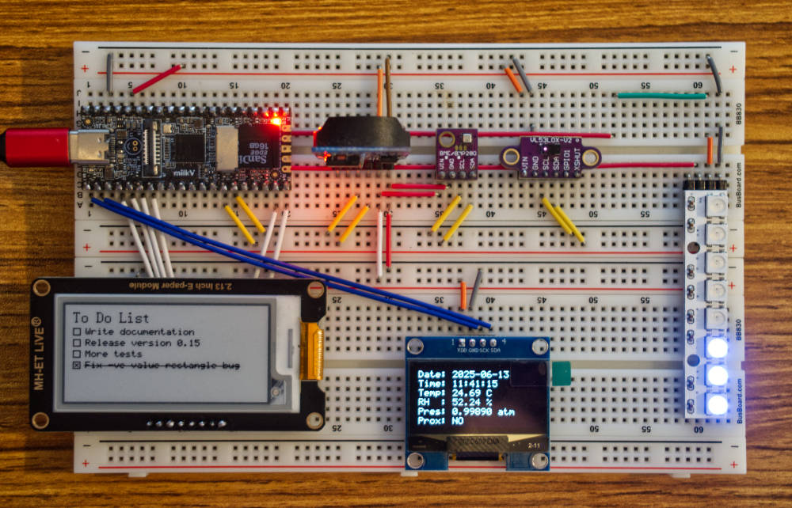
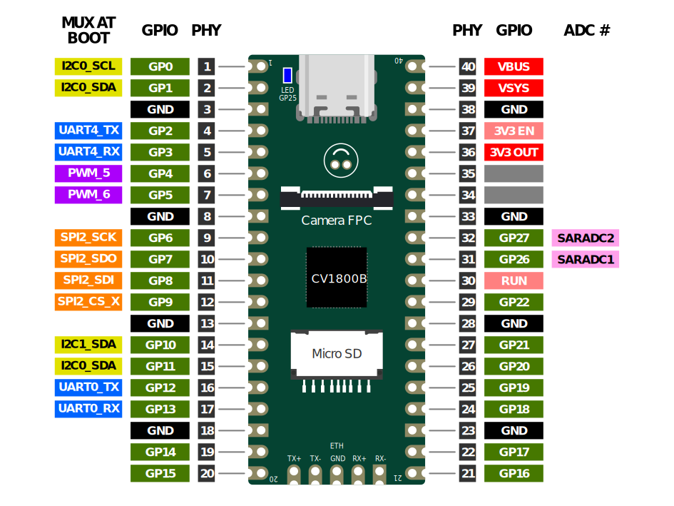

# mruby-denko-milkv-duo

<p align="center">
  
</p>

The Milk-V Duo is a tiny (same footprint as a Raspberry Pi Pico) single board computer, but with a 1 GHz RISC-V CPU running Buildroot Linux. This project makes it simple to do electronics programming on it in mruby. It implements `Denko::Board` compatible with the [CRuby gem](https://github.com/denko-rb/denko), so all those peripheral drivers/classes can be used as-is, and are included in the the mruby build. About [50](https://github.com/denko-rb/denko/blob/master/PERIPHERALS.md) are implemented so far.

### Supported Milk-V Boards
- Milk-V Duo 64M
- Milk-V Duo 256M
- Milk-V Duo S

## Installation
- Download the appropriate Buildroot Linux image for your board, from the [official repo](https://github.com/milkv-duo/duo-buildroot-sdk/releases).
- Using [balenaEtcher](https://www.balena.io/etcher) or a similar tool, flash the image to a micro SD card.
- Insert the SD card into your board, and connect it to your computer.
- Download and unzip the mruby binaries for your board, from the [releases section](https://github.com/denko-rb/mruby-denko-milkv-duo/releases) of this repo.
- The Milk-V Duo creates a new network interface on your comptuer, so you can SSH/SCP into it.
- Its IP address is `192.168.42.1`, default username is `root`, and password is `milkv`
- Copy the binaries onto the board:
  ```console
  # Some older macs may require you omit the -O flag
  scp -O UNZIPPED_BINARY_FOLDER/* root@192.168.42.1:/usr/local/bin
  ```
- SSH into the board: `ssh root@192.168.42.1`
- Try the `mirb` shell, or copy over examples from [this](examples) folder, and try them with `mruby FILENAME.rb`
- If you have issues with PWM / I2C / SPI, see the [Pinmux](#pinmux) section below.

## Pinmux
Some pins on the Duo can perform multiple functions, but only one at a time (multiplexing).

### Default (at Boot) Multiplexing Setup



**Notes:**
- The Linux boot console uses `UART4` by default.
- Hardware `SPI2` (or `SPI3` on the Duo S) is the only usable SPI device available. It becomes `/dev/spidev0` in both cases. When initializing `Denko::SPI::Bus` give no index at all (default 0), or `index: 0`.

### Remultiplexing
- View the current multiplexing setup at any time with `duo-pinmux -l` or by calling `Board#map` from mruby.
- Use `duo-pinmux` to remux pins as needed. See official documentation [here](https://milkv.io/docs/duo/application-development/pinmux).

**Notes:**
  - Unlike most Linux systems, remuxing does **not** require a reboot to take effect.
  - However, changes made by `duo-pinmux` are not saved across reboots.
  - GP26 and GP27 must be muxed to their default GPIO functions for the SARADC (analog input) to work.

## Known Issues
- `Sensor::QMP6988` works only on `I2C::BitBang` buses, not on hardware I2C.
- `Sensor::RCWL9620` does not work at all.

## Limitations (relative to CRuby Denko)
- mruby does not have `Thread`. Methods like `#poll` and `#blink` will not work, since they cannot start their own threads in the background to update peripheral state, like they do on CRuby.
- `Board#digital_listen` is implemented however, but in a **C** thread that collects pin change events.
  - It does not use interrupts, but polls, aiming for ~10 kHz.
  - Peripherals like `RotaryEncoder` will not be as accurate as they are on [denko-piboard](https://github.com/denko-rb/denko-piboard).
  - It still cannot update `DigitalIO` instances and run callbacks in the background.
  - Do this by calling `Board#handle_listeners` periodically, in your application loop.
- `Board#analog_listen` is not implemented at all, as it would be too slow.
- `Board#spi_listen` is not implemented. `SPI::InputRegister#listen` will not work.
- Milk-V Duo has no on-board digital-to-analog converters (DACs), but the `AnalogIO::Output` class is included. It should work with external DACs, when support for these is added.
- Milk-V Duo has no on-board EEPROM. `EEPROM::Board` is automatically included, but will not work.
- UART hardware is available, but mruby support is not implemented yet.
  - The `UART` classes are automatically included in the build, but will not work yet.
  - Consequently, `Sensor::JSNSR04T` also will not work.
- `/dev/i2c-0` is fixed at 400 kHz and `/dev/i2c-1` is fixed at 100 kHz. These are reconfigurable, if you build your own Linux image from [here](https://github.com/milkv-duo/duo-buildroot-sdk).

## Build Instructions
- On Ubuntu 24.04: `sudo apt install wget git make gcc`
- Install Ruby 3.3 or later, from `apt`, `rbenv` or elsewhere.
- Clone mruby at [this commit](https://github.com/mruby/mruby/tree/b5197c22f69a5bec230d4c92e715cedff0a1bc55) or later.
- Clone the [Milk-V Duo SDK](https://github.com/milkv-duo/duo-sdk), so `duo-sdk` and `mruby` are in the same directory.
- Copy the [build config](build_config/denko_milkv_duo.rb) from this repo into `mruby/build_config`
- Edit `MILKV_DUO_VARIANT` in the copied file to match your board: 64M, 256M or S.
- Modify the build config as neeeded.
- In `mruby` root: `rake MRUBY_CONFIG=build_config/denko_milkv_duo.rb`
- When completed, the cross-compiled binaries will be in `mruby/build/#{MILKV_DUO_VARIANT}/bin`
- Folow the install instructions above.
